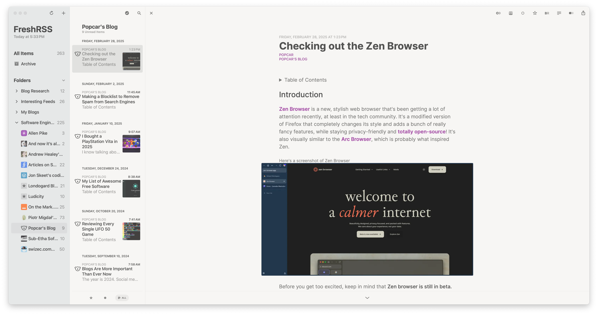
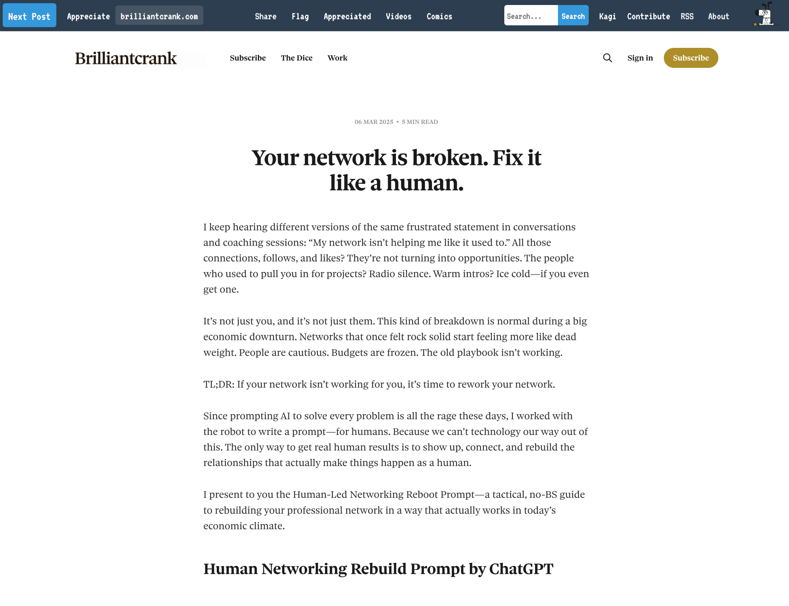

One of the things I've noticed about myself as I've gotten older is that I don't enjoy social media. Hardly ever did. The last time I was excited on social media was on Twitter circa 2009-2013, and then from 2014-2016.

I had a Facebook account because that is how you networked as a broke writer trying to forge her way into the prestigious Iowa Writer's Workshop MFA program[^1].

I had a public account and was on my phone way more than I should have been. Facebook was decent enough back then with apps like NetworkedBlogs to grab feeds from your favorite writer's blogs. A lot of folks were on BlogTalkRadio Network talking about their work.

There was even a time when I was working out a bunch and was into watching The Biggest Loser and following fitness channels on YouTube and Clean Eating Facebook groups. It felt like I belonged somewhere. A neurodivergent nerd without money whose close friends didn't really give a shit about her interests nor did they understand them? It felt like I "found my tribe".

But around 2012, 2013 I noticed a shift in the way I interacted with it. I was on it too much, I was saying too much, and I was noticing some awful stuff being said by people I formerly respected and bought their work. I wanted to delete my account. I said it on my "Wall".

One of my favorite people there messaged me and told me to stay; not having a Facebook account was career suicide and I really needed to stay. And so, like an addict, I kept my account.

## Nothing changed

I kept opening the app. I kept getting swept up into arguments with people who would dig in even if they were shown new evidence. 2016 happened and I was disillusioned. I deactivated my account several times. But I would come back, thinking that while I culled my friends list, these people _were_ my friends and they actually really care about me.

But when I logged back in, most people hadn't even noticed I was gone. They didn't know until I said that I was back; they didn't know I left in the first place. It was eye-opening. What I thought were my friends were people who had their own lives and shit to do that my absence didn't register because at the end of the day, most of those people have never met me and don't really know me, despite the amount of oversharing I did there.

When the shit jumped off after That Car Guy bought That Social Media Site I deleted my Facebook account, I deleted my Twitter accounts, and I signed up for Fediverse accounts, securing my username for the future.

Initially I liked it; it was new and cool and people were pretty awesome. But no one really interacted there. On my two most active accounts only one is enjoyable to use when it isn't football season. I feel broken every time I open my personal Mastodon account.

I get hardly any traction on my Bluesky account where I would like it, and the people I follow who I used to follow on Twitter are the same people with the same perspectives but being in the fray there just isn't appealing to me. I hate seeing the world burn on a neverending firehose of timelines. I already have my mental health challenges and watching, and reading, all of this is doing a number on me. I can't do it.

## RSS, blogs, and FreeTube

_RSS in Reeder Classic_

Fortunately RSS is still alive and kicking. I've found some pretty interesting blogs by using Kagi's version of what the oldheads used to [call](https://en.wikipedia.org/wiki/StumbleUpon) [StumbleUpon](https://web.archive.org/web/20090918020125/http://www.stumbleupon.com/) called [Kagi Small Web](https://kagi.com/smallweb/) where it will serve you up a random blog post and you can decide to "Appreciate" the post by visiting the website/blog.

_Kagi Small Web landing page_

What a revelation to me and I am glad I found it. It is a bookmark in my browser that I click whenever I need something interesting to read. If the post is interesting or thought-provoking, I'll visit the site and look through it, and if I like what I'm reading I'll add it to my RSS reader of choice and check in daily.

[FreeTube](https://github.com/FreeTubeApp/FreeTube) is an app to scrape YouTube and it is such a powerful tool because of YouTube's RSS feeds and a proxy service I won't name here.

But I use FreeTube as a way to keep the channels I actually learn things from separate from the random sports and game clips I watch to fill time.

## What this means for my social media usage

A lot of people I've seen on the internet have completely removed themselves from social media entirely, keeping a small circle of people they care about and who care about them updated in a newsletter or private blog post. This makes sense and something I may look into.

I will be deleting most of my social accounts except for Reddit, YouTube, and a one or two Mastodon servers. That's where I am at the moment.

My brain is tired of rot and craves learning new things. I may be old but I am forever curious and wanting to tinker with things. I also miss reading books and working with my hands, as well as writing software.

I have IRL friends and family that _actually_ know me and who I am and so I don't need to perform on these social apps and I don't need to watch the world burn around me in real-time, in 4K.

[^1]: Little did I know, or understand, that you have to have money to get your MFA, that or at least _come_ from money. Trust fund babies get MFAs, not late 20 something poor people.
