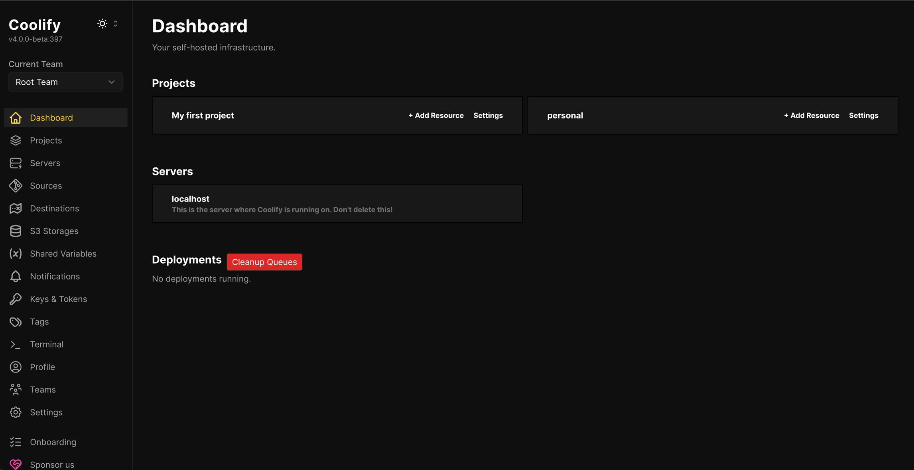
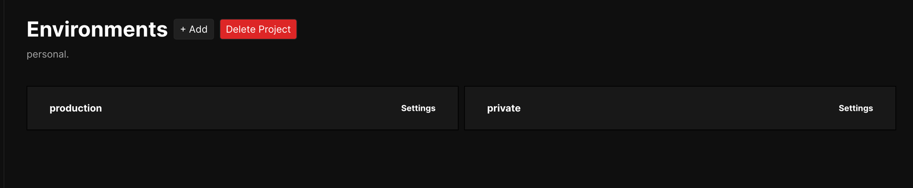
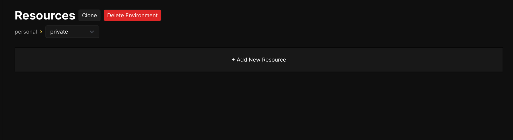
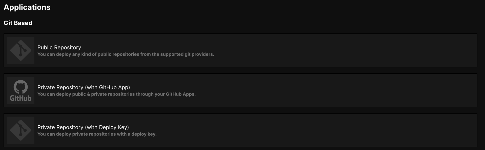
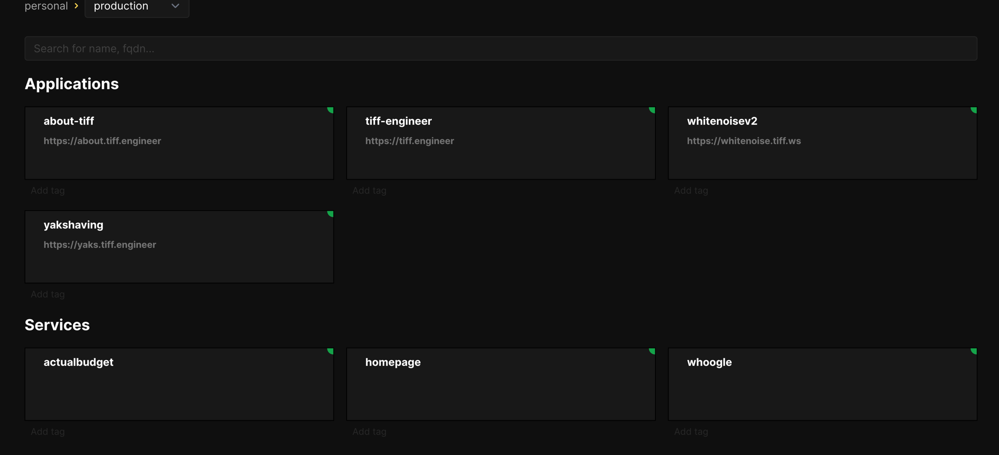

As the US collapses under the weight of its runaway tech oligarchy, I've decided to migrate as much of my code, writing, and data far away from the Big Tech™️ and VC hungry vultures ruining the internet.

I'd been self-hosting stuff for over a year on-prem but since I no longer have the luxury of running my servers on my own hardware, I decided to grab a couple cheap VPS servers from Hetzner with the minimal amount of compute I'd need to run a couple services and host my websites.

This very site is hosted by me. Where? Hetzner, of course. How? [Coolify](https://coolify.io/).

## A couple things to note

You _have_ to pay to do this _unless_ you can run servers in your house. That's free, as in you don't need to pay to use the services you host, but it _does cost_ something- energy, internet service, and the [rabbit hole of hardware](https://github.com/twhite96/homelab-config#these-are-the-tools-and-settings-i-am-using-in-my-home-lab) you can buy just to do something like this. If you have the means and the stomach, go for it. Depending on your level of interest and patience when things break, I think you'd enjoy it. I know I did.

## Setting up Coolify

I'm not going to be writing here about setting up a VPS and getting your server up and running. For that, I'll point you to [this video](https://www.youtube.com/watch?v=kTgu4wJ7v-0&pp=ygUHaGV0em5lcg%3D%3D).

For the most part, setting up a Coolify instance is as simple as a bash script:

```sh
sh curl -fsSL https://cdn.coollabs.io/coolify/install.sh | sudo bash
```

When you're setting it up, you have the option of using a remote server or localhost. For simplicity's sake, choose `localhost`.

Once that is done, you'll hit a screen that looks kinda like this:



You can create as many projects as you want[^1]. From there, you can deploy and serve your websites from here.

### Inside the projects tab

The first thing you'll notice is that you'll need to add an environment. There is already a default one there for you to work with called `production`. You can choose this as a starting place.



Here you can add your resources, which are basically apps, websites, containers, and services you can host on Coolify.



From here, choose a Git based service to deploy your app from GitHub or wherever on Coolify.



Then you can start cooking.



## Further things to research

Check out this cool (no pun intended, honest) [video](https://youtu.be/taJlPG82Ucw?si=8QJXhsblhgfGJddb) on how to get this set up in your own server environment.

[^1]: Be mindful of server resources.
