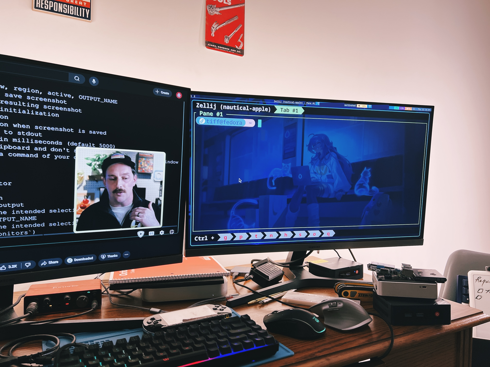
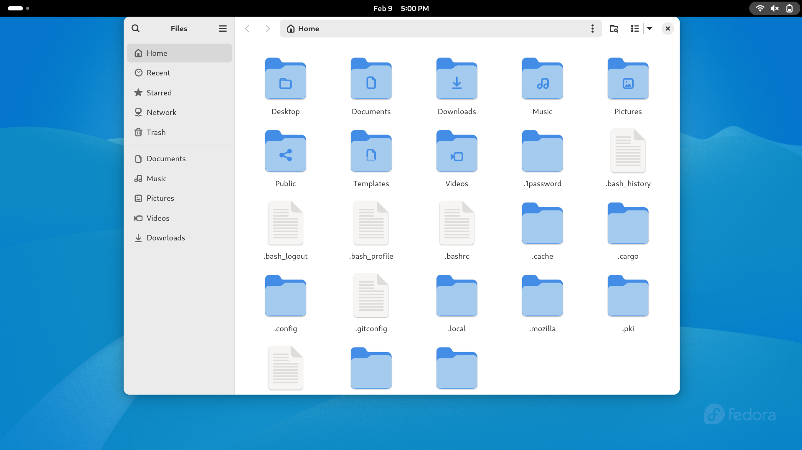
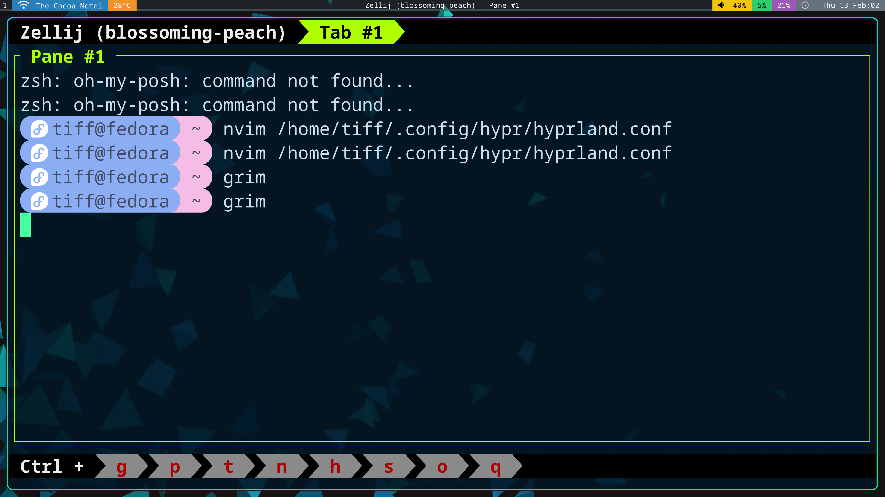

<small><em>My messy desk working on setting up Fedora with Hyprland and Waybar</em></small>

I've been living that motel life now for a couple months. While it is just a room, it is bigger, cleaner, and better for me all around.

I was able to salvage most of the important things from storage while we get that shutdown; ain't nobody got money for that. This is 2025 and you need to take out a loan to buy a bottle of ketchup so spending $260 on a storage unit when you can barely afford to eat is absolutely not it.

Regardless, I grabbed all my NUCs, my old Dell Inspiron laptop, all my keyboards, and after tomorrow my PC parts. I am not sure when I'll ever be able to afford another apartment, especially now, and I am not mentally capable of handling a job currently. Long story and not for this blog, anyhow. Ok, this post is about Linux, huh. Yeah, right.

## Okay, back up

I mainly work on my M1 Mac Mini. It is a great machine, but like I've said on Mastodon, I am not going to be able to replace it when it dies. This means I need to find an alternative I feel comfortable with _right now_, learn it, and prepare to switch to it full time.

I am extremely lucky that I went full bore into sysadmin work for the past year and a half. It meant that I needed to go through with learning the terminal, terminal commands, and being comfortable with keyboard shortcuts and keybindings.

I also switched full time to Neovim using LazyVim wrapper and a couple of other TUIs, such as Yazi, fzf, and zoxide.

Writing code explicitly inside my terminal for the past 6 months has been a hard fought battle but now I can't go back. Now that I have that skill, moving my work from macOS, with its unix underpinnings to Linux is not going to be as hard.

## Distro Hopping

I've tried all the usual distros like Ubuntu and Debian. I also tried [NixOS](https://nixos.org/) which didn't quite fit my workflow.

Learning _how_ Linux works takes a good amount of time and research. I only suggest switching to it if you meet the following criteria:

1. You need to have a computer for work and can't afford a Mac or a decent PC
2. You have time to invest in learning about Desktop Environments, Distros, File Managers, and all the other necessary things to fully get a grip on Linux
3. You hate Windows and are a masochist

[Distro Hopping is advised against](https://youtu.be/CJ41KZ0fBMc?si=yb8HJ_CsyfjGUt2k); you lose time and productivity when you do this. And now that I've got a system setup that I actually _like_, I refuse to hop unless I absolutely _have to_.

## My current setup

### On the Dell

Fedora 41 Workstation with GNOME Desktop

### On Beelink NUC

Fedora 41 with KDE Plasma DE and Hyprland Tiling Window Manager.

## Till next time

I'll probably talk more about setting up Hyprland and all that is involved with that.
